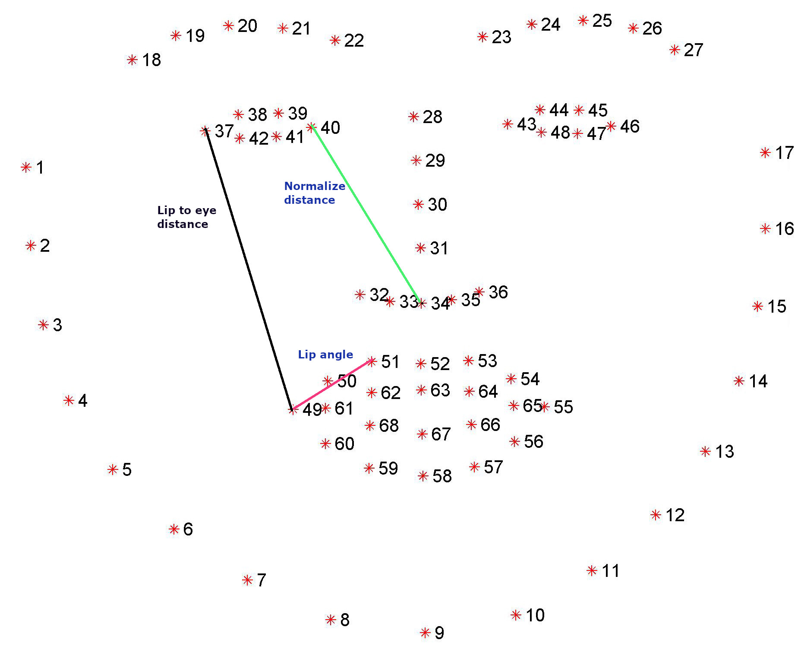
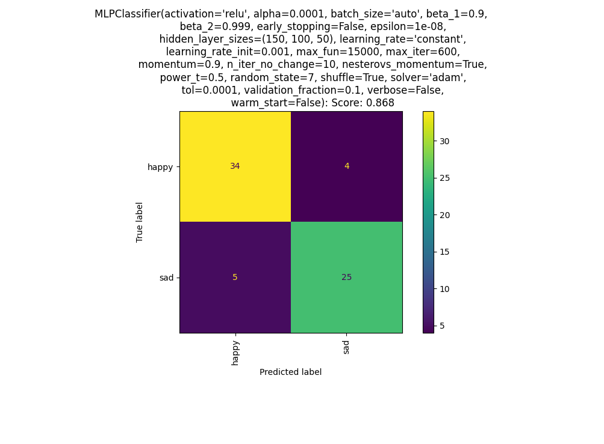

# Emotion classification using Landmarks

This code base was created as part of a Masters level college module.

## Goals

* Use dlib and OpenCv to implement happy or sad classification.
* Use facial landmarks to generate input features to a suitable Model.
* Implement Model on a live video feed.

## Dataset

At a high level images faces with labeled emotions is used to generate feature
vectors to train a Model.
* Dataset used: [Here](https://github.com/muxspace/facial_expressions)
* The above dataset consists of face images with associated emotions

## Image Preprocessing and generate raw dataset

* Face Alignment
```python
from imutils.face_utils.facealigner import FaceAligner

def align_face(image_path, save_image=True):
    """
    Standardize face orientation of face.
    :param image_path: Path to image
    :param save_image: Overwrite existing image
    """
    detector = dlib.get_frontal_face_detector()
    image = cv2.imread(image_path, cv2.IMREAD_GRAYSCALE)
    predictor = dlib.shape_predictor("shape_predictor_68_face_landmarks.dat")
    faces = detector(image, 1)
    if faces:
        for face in faces:
            aligned_image = FaceAligner(predictor, desiredFaceWidth=300).align(image, image, face)
            if save_image:
                cv2.imwrite(image_path, aligned_image)
            else:
                cv2.imshow("Aligned", aligned_image)
                cv2.waitKey(0)
``` 
* Extract Features  
```python
def extract_features(landmarks, emotion):
    """
    Extract a list of features from the provided face landmarks
        Features:
            0: eye_area
            1: inner_mouth_area -> Larger indicates open mouth potentially due to smiling
            2: mouth_area -> Larger indicates larger mouth due to smiling
            3: lip_slope -> slope of lips
            3: lip_to_eye_distance -> Shorter indicated smiling

    :param landmarks: Face landmarks
    :param emotion: Associated emotion with landmarks. Appended to feature list
    :return: Feature vector
    """

    right_eye_slice = FACIAL_LANDMARKS_68_IDXS['right_eye']
    left_eye_slice = FACIAL_LANDMARKS_68_IDXS['left_eye']
    inner_mouth_slice = FACIAL_LANDMARKS_68_IDXS['inner_mouth']
    outer_mouth_slice = (48, 60)

    # Distance to normalize all measurements
    nose_to_inner_eye_distance = line_length(landmarks[33], landmarks[39])

    mouth_area = area_of_polygon(landmarks[outer_mouth_slice[0]:outer_mouth_slice[1]]) / nose_to_inner_eye_distance
    inner_mouth_area = (area_of_polygon(landmarks[inner_mouth_slice[0]:inner_mouth_slice[1]]) or 1) / nose_to_inner_eye_distance
    right_eye_area = area_of_polygon(landmarks[right_eye_slice[0]:right_eye_slice[1]])
    left_eye_area = area_of_polygon(landmarks[left_eye_slice[0]:left_eye_slice[1]])
    average_eye_area = ((right_eye_area + left_eye_area) / 2) / nose_to_inner_eye_distance

    lip_slope = slope_of_line(landmarks[48], landmarks[50])

    lip_distance_to_eye = line_length(landmarks[36], landmarks[48])

    return [average_eye_area, inner_mouth_area, mouth_area,
            lip_slope, lip_distance_to_eye, emotion]
```



## Results
    Prediction score: 0.8676470588235294



